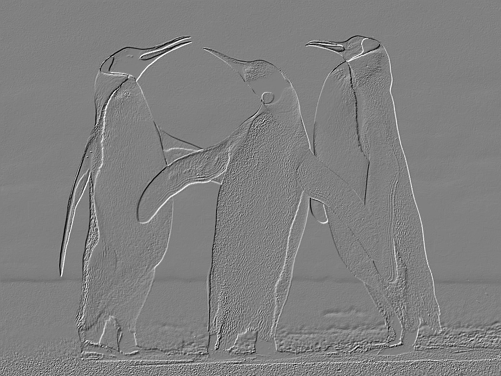

# Image Editor

This programs manipulates images (in the [.ppm format](https://en.wikipedia.org/wiki/Netpbm#File_formats)) by applying the following transformations:

- Invert colors
- Convert to grayscale
- Generate an “embossed” image
- Add a motion-blur effect (with an amount value)

The inverting colors transformation is achieved by changing each pixel value to it's inverse value (i.e. 0 becomes 255, 240 becomes 15, and 127 becomes 128).

The grayscale effect is performed by averaging the pixels rgb values (i.e. a pixel with the rgb values of 25, 230, and 122 becomes 125, 125, 125 - (25 + 230 + 122) / 3 = 125).

The emboss convertion is done by finding the largest difference in rgb values with it's neighbours and adding 128. We then cap this value between 0 and 255 and apply it to the rbg values.

Motion Blur is achieved by averaging the samples surrounding pixel's rbg values.

## Examples

For these examples, we'll be altering the penguin image:


#### Grayscale


#### Emboss



#### Invert


#### Motion Blur


## Running the program

#### Command Line Syntax
```java ImageEditor i nputFileName outputFileName {grayscale|invert|emboss|motionblur blurLength}```

- The main class should be named ImageEditor.
- The inputfileName is the name of a file containing a ppm formatted picture.
- The o utputFileName is the name of a file that will contain the transformed picture. It
need not exist before executing the transformation. If the file exists and is writable it will
be overwritten.
- The b lurLength is a non-negative integer. It is usually less than 25.

As an example of running the program the following command would load bike.ppm, invert the
colors, and save it as bike-inverted.ppm:

```java ImageEditor bike.ppm bike-inverted.ppm invert```


## Aditional Information

For a detailed breakdown of the .ppm format, see [this](http://netpbm.sourceforge.net/doc/ppm.html) documentation.

For more information about this project, see [spec.pdf](ImageEditorSpec.pdf)
